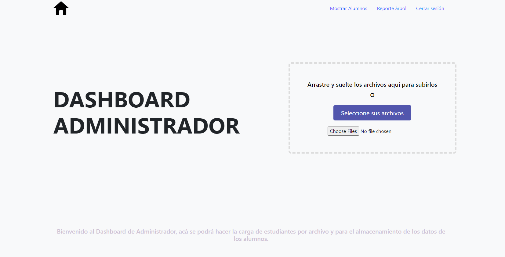
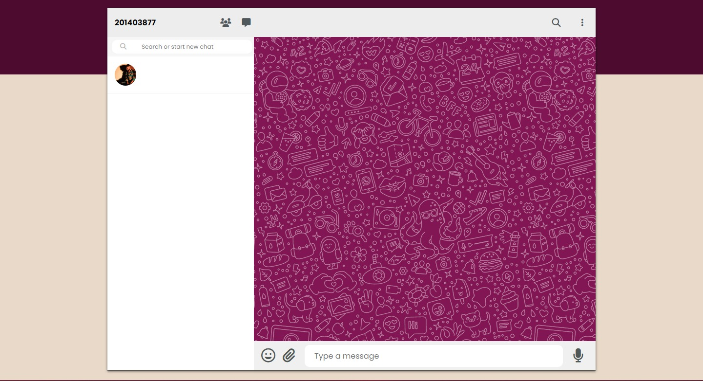

# Manual de Usuario

A continuación se detallan las principales instrucciones dirigidas hacia los usuarios de EDD GoDrive tras las nuevas features que fueron agregadas al culminar la fase 3 del proyecto.

___ 

## Admin Dashboard 😮🔊

En este dashboard el administrador puede manejar y supervisar la nube de EDD GoDrive. El panel se divide en las siguientes partes: 

### Tabla de Usuarios 🫂

En esta tabla se muestras los usuarios de los alumnos que hay dentro del sistema ya aprobados en una tabla, en este caso el administrador podrá visualizar carnet, nombre, y la contraseña encriptada por motivos de seguridad de los datos, como si de una base de datos se tratara.

### Tabla de Permisos 🪧

En esta tabla se muestran los permisos de los usuarios, donde se puede visualizar los archivos compartidos dentro del sistema, este mostrará el Usuario Propietario, el Usuario Destino, Ruta del archivo, Nombre de Archivo, Permiso del archivo. Además cuenta con
un botón para generar el reporte de mensajes el cual se explicará más adelante.

___

## User/Student Dashboard 👨🏽‍🎓📁

En este dashboard podrás manejar tu unidad de red en la nube de EDD GoDrive. El panel se divide en las siguientes partes: 

- Barra de Búsqueda 
Se encuentra en la parte superior, acá se puede ingresar a cualquier carpeta a través de su ruta.

- Panel de Archivos
Se encuentra en el centro del dashboard y despliega la lista de archivos y carpetas que se encuentran dentro de la ruta que se ingrese en la barra de búsqueda.

- Barra Lateral
Se encuentra al lado izquierdo, se indica el número de carnet del estudiante y además en la parte inferior cuenta con dos botones que permiten crear y eliminar carpetas.

- Barra de Menú
Se encuentra en la parte inferior, acá se encuentran todos los botones que permiten generar ambos reportes, modificar archivos y cerrar sesión.

### Nuevas Funciones

- #### Compartidos Conmigo 🫂📂

En este apartado el usuario puede visualizar todos los archivos que otros usuarios dentro de EDD GoDrive han compartido con el mismo. Se muestra una lista de todos los archivos con el que se cuentan los permisos de acceso.

- #### Sistema de Mensajería 🌬️📲

Con el fin de ayudar la comunicación entre los estudiantes, se realizó un apartado nuevo donde el estudiante puede enviar mensajes a otros usuarios, los mensajes para seguridad de la conversación entre los estudiantes son encriptados.

Cuando el usuario emisor envía un mensaje, el texto es encriptado y se queda así hasta que el usuario receptor inicie sesión y pueda revisar los mensajes nuevos y se desencripta el mensaje para su visualización. Para el manejo de la mensajería se utilizó el sistema de BlockChain para la seguridad e integridad del mismo. 

___

## Reportes

- ### Reporte Carpetas 🗄️🗃️

Se muestra el reporte del grafo dirigido, para visualizar las
relaciones y conexiones que hay entre carpetas.

- ### Reporte Mensajería 📨📫

El administrador puede visualizar de manera general todo el sistema de mensajería mediante un reporte, teniendo en cuenta que el mensaje siempre se visualiza encriptado para mayor seguridad, este es generado.

___

___

# Manual Técnico 🤓💻

## Estructuras Utilizadas

### Grafo Dirigido 🏹📊

Un grafo dirigido es una estructura de datos que consiste en un conjunto de nodos (vértices) conectados por aristas dirigidas (flechas). Cada arista tiene una dirección y se utiliza para representar una relación asimétrica entre dos nodos, donde uno de ellos es el origen y el otro es el destino. Los grafos dirigidos se utilizan en una amplia variedad de aplicaciones informáticas, como en la representación de redes de comunicación, en la planificación de rutas en sistemas de navegación, en el análisis de dependencias en sistemas de compilación, en la representación de estructuras de datos complejas, entre otros. La manipulación de grafos dirigidos puede realizarse mediante diversas técnicas algorítmicas, como el recorrido de grafos (DFS o BFS), la búsqueda de caminos más cortos, la detección de ciclos, entre otras.

Abreviando la estructura de un grafo dirigido sería la siguiente:

~~~
  constructor() {
    this.nodos = [];
    this.aristas = new Map();
  }

  agregarNodo(nodo) {
    this.nodos.push(nodo);
    this.aristas.set(nodo, []);
  }

  agregarArista(origen, destino) {
    this.aristas.get(origen).push(destino);
  }
~~~

Se utilizó en esta fase del proyecto para el manejo de carpetas.

### Tabla Hash 🗒️👥

Una tabla hash es una estructura de datos que se utiliza para almacenar y buscar valores utilizando claves. La tabla hash utiliza una función hash para convertir la clave en un índice en una tabla o arreglo, donde se almacena el valor correspondiente. La función hash toma la clave como entrada y devuelve un valor entero, que se utiliza como índice en la tabla hash.

La principal ventaja de una tabla hash es que permite una búsqueda rápida de valores en promedio, incluso para grandes conjuntos de datos. La búsqueda de un valor en una tabla hash se realiza en tiempo constante O(1), siempre y cuando la función hash esté bien diseñada y la tabla tenga un tamaño adecuado. Sin embargo, en el peor de los casos, la búsqueda puede tardar O(n), donde n es el número de elementos almacenados en la tabla hash.

Las tablas hash se utilizan comúnmente en la programación para implementar estructuras de datos como diccionarios, mapas, conjuntos y cachés. Algunos ejemplos de lenguajes de programación que utilizan tablas hash son Python (en su tipo de datos "diccionario"), Ruby (en su tipo de datos "hash") y JavaScript (en su objeto "Map" y en la sintaxis de objetos literales).

La estructura de una tabla Hash resumida en JavaScript sería la siguiente:

~~~
class TablaHash {
  constructor() {
    this.tabla = {};
  }

  agregar(clave, valor) {
    this.tabla[clave] = valor;
  }

  obtener(clave) {
    return this.tabla[clave];
  }

  eliminar(clave) {
    delete this.tabla[clave];
  }

  estaVacia() {
    return Object.keys(this.tabla).length === 0;
  }

  tamano() {
    return Object.keys(this.tabla).length;
  }

  claves() {
    return Object.keys(this.tabla);
  }
}
~~~

Cabe resaltar que lo importante en una tabla hash es de realizar una función hash que sea eficiente en base a lo que se desea almacenar.

Se utilizó en esta fase del proyecto para el almacenamiento de los usuarios.

### BlockChain 🕵️🔐

El blockchain es una tecnología de registro distribuido que se utiliza para almacenar y gestionar datos de forma segura, transparente y descentralizada. Consiste en una cadena de bloques interconectados, donde cada bloque contiene información y un registro de transacciones.

La principal característica del blockchain es que los datos se almacenan en múltiples nodos de la red en lugar de en un servidor centralizado. Cada nodo tiene una copia de la cadena de bloques completa, lo que garantiza que cualquier cambio en los datos debe ser validado y aprobado por la mayoría de los nodos de la red antes de ser registrado.

El blockchain utiliza criptografía para garantizar la seguridad de los datos almacenados en él. Cada bloque en la cadena tiene un hash que se calcula utilizando los datos del bloque anterior, lo que hace que sea muy difícil modificar los datos sin cambiar todo el blockchain. Además, el blockchain utiliza un algoritmo de consenso para validar y aprobar transacciones, lo que garantiza que todas las partes en la red estén de acuerdo con las transacciones realizadas.

El blockchain se utiliza comúnmente como una tecnología subyacente para las criptomonedas, pero también se ha utilizado en otras áreas como la gestión de cadenas de suministro, la votación electrónica, la propiedad de activos y más. Su capacidad para garantizar la transparencia, la seguridad y la descentralización lo hace atractivo para muchas aplicaciones.

Cómo se implementa el BlockChain en JavaScript:
~~~
class Bloque {
  constructor(datos, hashAnterior) {
    this.datos = datos;
    this.hashAnterior = hashAnterior;
    this.nonce = 0;
    this.hash = this.calcularHash();
  }

  calcularHash() {
    return this.hashAnterior + this.datos + this.nonce;
  }

  minar(dificultad) {
    let dificultadObjetivo = new Array(dificultad + 1).join("0");
    while (this.hash.substring(0, dificultad) !== dificultadObjetivo) {
      this.nonce++;
      this.hash = this.calcularHash();
    }
    console.log("Bloque minado: " + this.hash);
  }
}

class Blockchain {
  constructor() {
    this.chain = [this.crearBloqueGenesis()];
    this.dificultad = 4;
  }

  crearBloqueGenesis() {
    return new Bloque("Bloque Genesis", "0");
  }

  obtenerUltimoBloque() {
    return this.chain[this.chain.length - 1];
  }

  agregarBloque(nuevoBloque) {
    nuevoBloque.hashAnterior = this.obtenerUltimoBloque().hash;
    nuevoBloque.minar(this.dificultad);
    this.chain.push(nuevoBloque);
  }

  esValido() {
    for (let i = 1; i < this.chain.length; i++) {
      const bloqueActual = this.chain[i];
      const bloqueAnterior = this.chain[i - 1];
      if (bloqueActual.hash !== bloqueActual.calcularHash()) {
        return false;
      }
      if (bloqueActual.hashAnterior !== bloqueAnterior.hash) {
        return false;
      }
    }
    return true;
  }
}

~~~

Se utilizó en esta fase del proyecto para la seguridad y encriptación de envío de mensajes y manejo de datos.

___
___

## Front End 👤💻

El proyecto en el que se ha trabajado ha requerido el uso de HTML, CSS y JavaScript para la creación de una página web funcional y atractiva visualmente. Estos lenguajes son fundamentales en el desarrollo de páginas web modernas y su uso adecuado permite crear experiencias en línea atractivas y personalizadas para los usuarios.

En el caso específico de HTML, se ha utilizado para definir los diferentes elementos que componen la página web, como encabezados, párrafos, imágenes y enlaces. La correcta estructuración del contenido utilizando HTML es fundamental para que la página web sea fácilmente accesible y comprensible para los usuarios, así como para los motores de búsqueda.

Por otro lado, CSS se ha utilizado para aplicar estilos visuales a los diferentes elementos de la página web, logrando una coherencia visual entre ellos y un diseño visualmente atractivo y coherente en toda la página. Con CSS se han definido propiedades como colores, fuentes, márgenes y tamaños para cada uno de los elementos de la página, permitiendo una personalización y diferenciación visual de cada elemento.

Finalmente, JavaScript ha sido utilizado para crear interactividad y funcionalidades más complejas en la página web, como animaciones, validaciones de formularios y efectos visuales interactivos. Con JavaScript, se han podido crear elementos interactivos que permiten una experiencia de usuario más atractiva e inmersiva.

En conclusión, el uso de HTML, CSS y JavaScript ha sido esencial en el desarrollo del proyecto, permitiendo la estructuración del contenido, la definición de los estilos visuales y la creación de interactividad y funcionalidades avanzadas en la página web. Cada uno de estos lenguajes ha desempeñado un papel importante en la creación de la página y su correcto uso ha sido clave para lograr los objetivos de diseño y funcionalidad establecidos. Gracias a estos lenguajes, se ha creado una página web moderna, atractiva y funcional que cumple con los requerimientos y expectativas del proyecto.

### Bootstrap 🅱️🧠

Bootstrap es un framework de diseño web que proporciona una biblioteca de componentes predefinidos y estilos CSS para la creación de páginas web responsivas y atractivas visualmente. En el proyecto en el que se ha trabajado, se ha utilizado Bootstrap para agilizar el proceso de diseño y para garantizar una experiencia de usuario consistente y de alta calidad en todas las pantallas y dispositivos.

Bootstrap ha permitido la creación de una estructura de página clara y fácil de navegar mediante la utilización de su sistema de rejilla, que ha ayudado a organizar el contenido de manera efectiva en diferentes dispositivos y tamaños de pantalla. Además, Bootstrap ha proporcionado una biblioteca de componentes que han sido utilizados en la página web, como botones, menús desplegables, tarjetas y formularios. Estos componentes han permitido una personalización fácil y rápida, así como una consistencia visual en toda la página web.

Otra de las ventajas de utilizar Bootstrap en el proyecto ha sido la capacidad de personalizar y extender su biblioteca de componentes. Esto ha permitido que la página web tenga un diseño único y personalizado, sin tener que crear cada componente de manera individual. Asimismo, Bootstrap ha proporcionado una gran cantidad de estilos CSS predefinidos que han sido utilizados en la página web para lograr una presentación visualmente atractiva y coherente en toda la página.

### Github Pages 🐈‍⬛🌐

GitHub Pages es un servicio de alojamiento web gratuito que permite publicar sitios web directamente desde un repositorio de GitHub. En el proyecto en el que se ha trabajado, se ha utilizado GitHub Pages para alojar la página web de manera gratuita y fácil, lo que ha permitido compartir el trabajo de manera sencilla y rápida.

La utilización de GitHub Pages ha permitido alojar la página web sin necesidad de utilizar servicios de alojamiento externos, lo que ha reducido los costos y la complejidad del proceso de publicación. Además, GitHub Pages ofrece una integración sencilla con Git, lo que ha permitido la gestión y el control de versiones de manera efectiva.

~~~
Universidad San Carlos de Guatemala 2023
Programador: Harry Aaron Gómez Sanic
Carné: 202103718
~~~